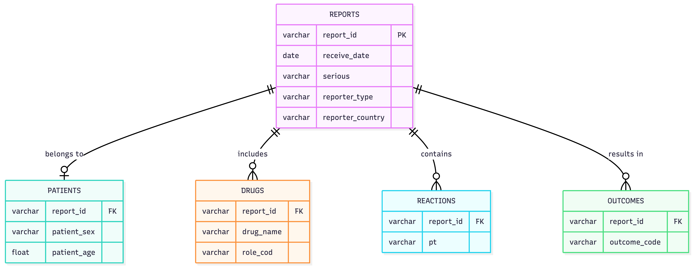

# DS 4320 Project 1: FAERS Pharmacovigilance Serious Outcome Detection

**Executive Summary**
This project provides an automated data pipeline to process the FDA Adverse Event Reporting System (FAERS) database. By organizing millions of reports into a relational DuckDB database, a machine learning triage engine was built. This tool predicts severe patient outcomes (like hospitalization or death) based on age, the number of medications taken, and exposure to known high-risk drugs. This allows regulatory leads to prioritize the most dangerous cases immediately.

| Project Identity | Resource Links |
| :--- | :--- |
| **Name:** Michael Carlson | [Press Release File](press_release.md) |
| **NetID:** mjy7nw | [UVA OneDrive Data Directory](https://myuva-my.sharepoint.com/:f:/g/personal/mjy7nw_virginia_edu/IgBN5u2lUrCQQp4yvMHYp_ykAWy9Ktwu-TP16ULtfDB8S9g?e=oAYx0b) |
| **DOI:** [Insert DOI Badge Here] | [Pipeline Notebook](pipeline.ipynb) |
| **License:** [MIT](LICENSE) | [Pipeline Markdown](pipeline.md) |

## Problem Definition
**General Problem:** 8. Clinical drug trials and safety of drugs in post-market phase.

**Specific Problem Statement:** Can we build a data-driven solution that identifies high-priority FDA adverse event reports across the entire population, regardless of the specific drug involved, by modeling the historical risk factors of patient age, polypharmacy burden, high risk drugs, and the person who reports it?

**Rationale for Refinement:** Pivoting from a narrow medical hypothesis (e.g., "Is Ibuprofen dangerous?") to a data-driven model allows the model to learn the underlying systemic risk factors of a patient. Including drug identity as a binary clinical prior (`is_high_risk_drug`) merges mechanistic pharmacological ground-truth with population-level generalizability.

**Motivation for the Project:** The FDA receives millions of voluntary adverse event reports over a decade, far exceeding the capacity of human regulatory analysts to review them in real-time. This severe bottleneck means that fatal drug-drug interactions or life-threatening geriatric responses can remain buried under thousands of minor, non-serious complaints like mild nausea. The motivation behind this project is to protect public health by drastically reducing the time-to-intervention; an automated triage engine ensures that regulatory leads can immediately focus their limited resources on the most critical, high-probability emergencies the moment they enter the system.

**Press Release:** [ML Triage Revolutionizes FDA Drug Safety Monitoring](press_release.md)

---
## Domain Exposition
**Terminology Table:**
| Term | Definition |
| :--- | :--- |
| **ADR / ADE** | Adverse Drug Reaction (unintended harm from normal dose) / Adverse Drug Event (includes errors and overdoses). |
| **FAERS** | FDA Adverse Event Reporting System; the primary database for tracking drug safety after a drug is approved. |
| **Pharmacovigilance** | The science of tracking, understanding, and preventing negative side effects of medications. |
| **Signal Detection** | Finding a statistical pattern that suggests a specific drug might be causing a specific side effect. |
| **MedDRA** | The standardized medical dictionary used to categorize adverse events uniformly. |
| **Primary Suspect Drug** | The specific medication that the reporter believes caused the negative reaction. |
| **Serious Outcome** | A result that includes death, hospitalization, life-threatening conditions, or permanent disability. |
| **Polypharmacy** | A patient taking multiple different medications at the same time, which heavily increases the risk of side effects. |

**Domain Explanation:**
This project shifts pharmacovigilance from reactive to proactive. Traditionally, regulators look for historical spikes in specific drug side effects. This project instead calculates the immediate, individual risk of a severe outcome the moment a report is filed, using patient demographics and drug profiles to route the case for urgent human review.
**Background Reading Folder:** [OneDrive Literature Repository](https://myuva-my.sharepoint.com/:f:/r/personal/mjy7nw_virginia_edu/Documents/3Y/3YS/DS%204320/proj1/background%20readings?csf=1&web=1&e=AA0LG1) 

**Background Reading Table:**
| Source Title | Relevance | Source URL/Reference |
|--------------|-----------|----------------------|
| Serious Adverse Drug Events Reported to the FDA: Analysis of the FAERS 2006-2014 Database (Sonawane et al., 2018) | Documents a 2-fold increase in serious ADEs (including 244,000+ deaths), highlighting the urgent need for scalable safety triage. | [PDF Link](https://myuva-my.sharepoint.com/:b:/g/personal/mjy7nw_virginia_edu/IQDe0jmOSLzhSr1eDOacWqRhAbEqiufxMJ-jSZqnh560cEE?e=Jzkpft) |
| Integration of FAERS, DrugBank and SIDER Data for Machine Learning-based Detection of ADRs (Schreier et al., 2024) | Demonstrates that ML models combining FAERS data with engineered features achieve higher recall/precision than conventional methods. | [PDF Link](https://myuva-my.sharepoint.com/:b:/g/personal/mjy7nw_virginia_edu/IQD8MzJPZoIkQ63AL3kZ4WFWAdCfCPBgaHhy-9j3BX9jKbA?e=cMzhcd) |
| Developing an AI-Guided Signal Detection in the FAERS (Al-Azzawi et al., 2023) | Proof-of-concept showing ML frameworks can automate control group selection and dismiss false-positive signals systematically. | [PDF Link](https://myuva-my.sharepoint.com/:b:/g/personal/mjy7nw_virginia_edu/IQDGL7CkIzbsToAf4tsKPQ3LAQRbc_ZO6M2ngrfHGcKLC3c?e=7hZxYi) |
| A Pilot, Predictive Surveillance Model in Pharmacovigilance Using ML Approaches (Ferreira et al., 2024) | Details an ML gradient boosting approach that demonstrated acceptable accuracy and detected a true safety signal six months earlier than human review. | [PDF Link](https://myuva-my.sharepoint.com/:b:/g/personal/mjy7nw_virginia_edu/IQAVExTS_gzqQ6yJlajvAHmHAeAsYr9tiwyImHFiJmPLJCs?e=aoBugd) |
| Adverse drug reactions as cause of admission to hospital: prospective analysis (Pirmohamed et al., 2004) | Foundational study establishing that 6.5% of hospital admissions are caused by ADRs, carrying a massive projected financial and mortality burden. | [PDF Link](https://myuva-my.sharepoint.com/:b:/g/personal/mjy7nw_virginia_edu/IQBaLTOFWaU-TZLyFK8bv4qDAaOFRHf4ST50G3F-TGB0-tI?e=R56mwG) |

## Data Creation

> ### 🛠 Data Provenance & Reproducibility
> All data is pulled directly from the **OpenFDA API** using `01_faers_bulk_download.py`. The pipeline is designed to be **reproducible**; running the ingestion scripts will refresh the local `faers_ml.duckdb` without duplicating records. All engineered artifacts are stored in the [UVA OneDrive Directory](https://myuva-my.sharepoint.com/:f:/g/personal/mjy7nw_virginia_edu/IgDpgQQ1-uZ8TbiHbMXPD7xaAX6MqHnvhya5nWgsXy54iFU?e=Uaq5f2) to ensure persistent access and auditability. The data is downloaded it its raw nested JSON format, then flattened into relational tables using DuckDB SQL queries. The final modeling dataset is exported as Parquet files for efficient loading into the ML pipeline. 

**Code Provenance Table:**
| Script | Description | Link |
|--------|-------------|------|
| `01_faers_bulk_download.py` | Retrieves and stages raw FAERS JSON archives. | [GitHub](https://github.com/mrcarlson3/faers-signal-ml/blob/main/01_faers_bulk_download.py) |
| `01_faers_ingestion.py` | Flattens nested JSON hierarchies into relational NDJSON files. | [GitHub](https://github.com/mrcarlson3/faers-signal-ml/blob/main/01_faers_ingestion.py) |
| `02_duckdb_schema.sql` | Establishes the relational schema and ingests data into `faers_ml.duckdb`. | [GitHub](https://github.com/mrcarlson3/faers-signal-ml/blob/main/02_duckdb_schema.sql) |
| `03_feature_engineering.py` | Executes CTEs to build clinical proxy features and exports to Parquet. | [GitHub](https://github.com/mrcarlson3/faers-signal-ml/blob/main/03_feature_engineering.py) |

**Bias Identification:**
Spontaneous passive reporting systems face immense biases, notably drastic under-reporting and "confounding by indication" (sicker patients take more drugs and experience more adverse events). Missing data is not missing at random; severe outcomes are more likely to have complete reporting data than minor events.

> ### ⚖️ Analytic Rigor: Bias Mitigation
> To address the **masking effects** inherent in FAERS, we utilize `balanced_subsample` class weighting, which adjusts weights at the bootstrap level to ensure rare severe signals are not drowned out by non-serious reports. Furthermore, we use **Stratified Sampling** to ensure the rare outcome distribution is preserved across training and testing splits.

## Metadata
**ER Diagram:**

**Data Table List:**
The resulting structural tables inside DuckDB, exported as Parquet format:
| File Name | Description |
| :--- | :--- |
| `faers_reports.parquet` | Administrative report IDs and dates. |
| `faers_patients.parquet` | Patient age and biological sex. |
| `faers_drugs.parquet` | Medications taken, marked as suspect or concomitant. |
| `faers_reactions.parquet` | Specific side effects experienced (MedDRA terms). |
| `faers_outcomes.parquet` | Severe consequences mapped to reports (e.g., Death). |

**Data Dictionary:**
| Table | Feature | Description | Data Type | Missingness & Notes |
| :--- | :--- | :--- | :--- | :--- |
| `reports` | `report_id` | Unique FDA identification number. | VARCHAR | Primary key. Complete reliability. |
| `reports` | `receive_date` | Date the FDA received the report. | DATE | Complete. High reliability. |
| `reports` | `serious` | Indicator if the overall event was classified as serious. | VARCHAR | High reliability. Serves as a high-level filter. |
| `reports` | `reporter_type` | Qualification of the person reporting (e.g., Physician, Consumer). | VARCHAR | Moderate missingness. Influences clinical accuracy. |
| `reports` | `reporter_country` | Country where the adverse event occurred. | VARCHAR | Moderate missingness. |
| `patients` | `report_id` | Foreign key linking the patient to their specific report. | VARCHAR | Complete. |
| `patients` | `patient_sex` | Biological sex of the patient. | VARCHAR | Moderate missingness. |
| `patients` | `patient_age` | Age of patient at the time of the event. | FLOAT | High missingness; frequently omitted by voluntary reporters. |
| `drugs` | `report_id` | Foreign key linking the drug to the report. | VARCHAR | Complete. |
| `drugs` | `drug_name` | Name or active ingredient of the medication taken. | VARCHAR | Spelling variations and generic/brand mixing exist. |
| `drugs` | `role_cod` | Marks if the drug is the suspected cause (PS) or just present (C). | VARCHAR | High reliability. |
| `reactions` | `report_id` | Foreign key linking the reaction to the report. | VARCHAR | Complete. |
| `reactions` | `pt` | Standardized MedDRA term (Preferred Term) for the side effect. | VARCHAR | Standardized, but subject to the reporter's medical judgment. |
| `outcomes` | `report_id` | Foreign key linking the outcome to the report. | VARCHAR | Complete. |
| `outcomes` | `outcome_code` | Specific tag indicating a severe result (e.g., DEATH, HOSPITAL). | VARCHAR | Blank for non-serious events; biased toward fatal/severe cases. |
